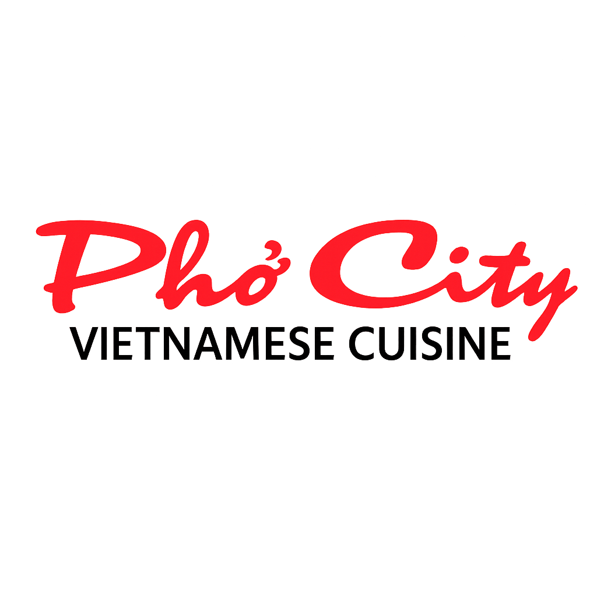
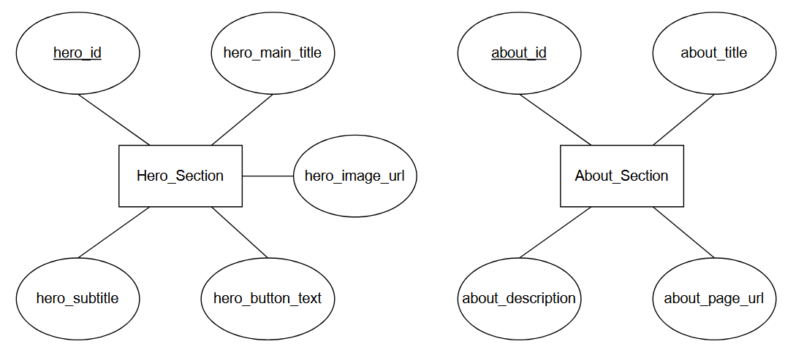
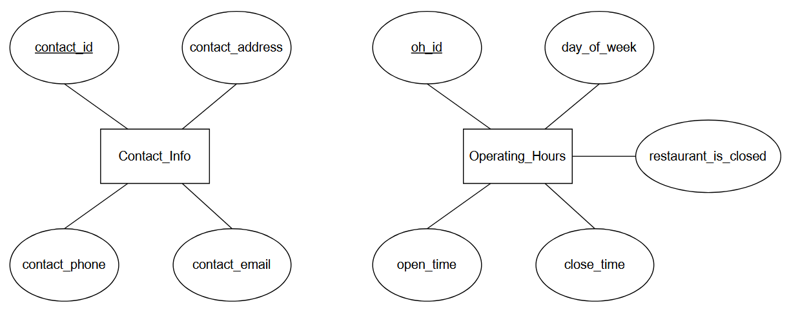
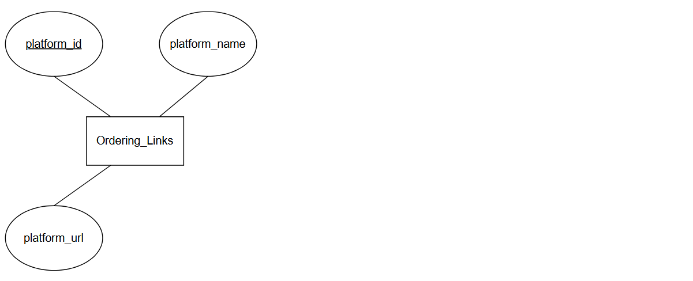
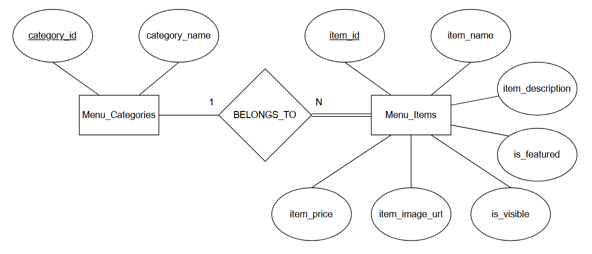
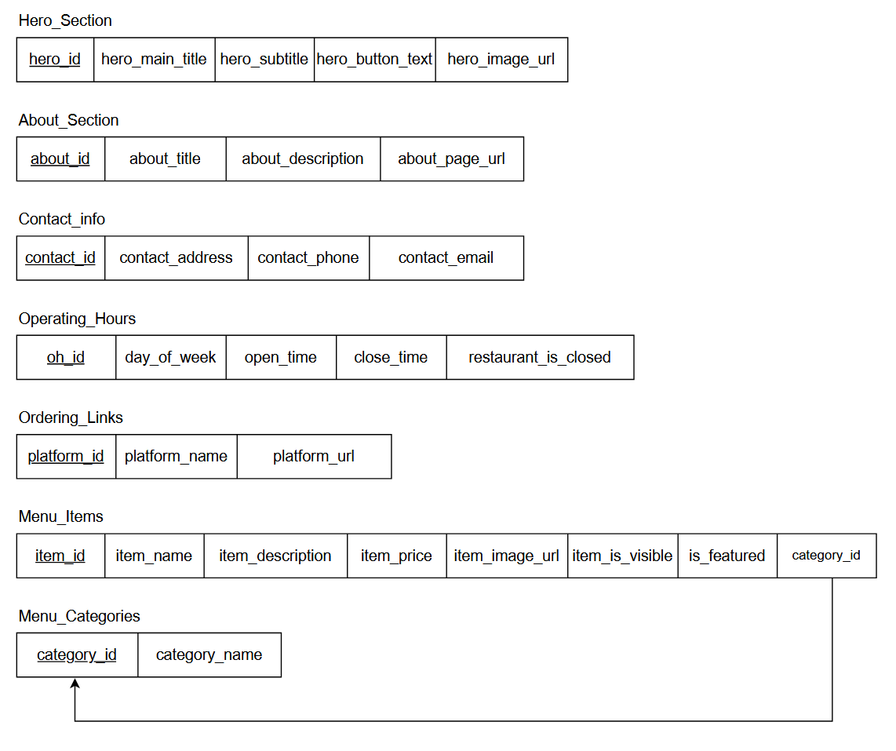

<p align="center">
  
</p>

# Pho-City-Website Synopsis:

The Pho City website is a **full-stack web application** developed for the owner **Huu Trung Tran** and **Pho City**, a family-owned Vietnamese restaurant in Sacramento. The restaurant currently struggles with having an online presence without relying on third-party systems like **DoorDash** or **Yelp**, and has difficulty keeping an updated menu available online. This leads to issues such as inconsistent or outdated menus and limited access for customers trying to view hours, menu details, or contact information.

To solve these problems, this project focuses on building a user-friendly, modern, and responsive website that serves as a centralized hub for customers. The website will provide easy access to the menu, contact details, restaurant information, and ordering options. The site aims to improve customer experience and strengthen Pho City’s online presence by providing a reliable and accessible platform for customer interaction.

Another key problem this project addresses is creating an authorized administrative side of the website. This includes a full **Content Management System (CMS)** that allows the restaurant and authorized users to create, update, delete, and manage website content, such as menu categories, items, prices, descriptions, images, and page text. This ensures Pho City can independently maintain their website and keep information up to date even after the project is completed.

<br></br>

# Table of Contents
- [Technologies](#technologies)
- [Installation Instructions](#installation-instructions)
- [Database Setup](#database-setup)
- [Environment Files](#environment-files)
- [File Organization](#file-organization)
- [Backend API](#backend-api)
- [Testing](#testing)
- [Deployment](#deployment)
- [ER Diagram](#er-diagram)
- [Figma Prototype](#figma-prototype)
- [Jira Timeline](#jira-timeline)
  - [Sprint 01](#sprint01)
  - [Sprint 02](#sprint02)
  - [Sprint 03](#sprint03)
  - [Sprint 04](#sprint04)
- [Project Charter](#project-charter)
- [Team Praxis Credits](#team-praxis-credits)

<br><br>

# Technologies:

| **Frontend** | **Backend**     | **Tools**                 |
| ------------ | --------------- | ------------------------- |
| React        | Node.js         | Git & GitHub              |
| TypeScript   | Express.js      | Vite (Build Tool)         |
| TailwindCSS  | MySQL (AWS RDS) | Jira (Project Management) |

<br><br>

# Installation Instructions:

#### Clone the repository

```bash
mkdir FolderName                                                         #(1) Replace FolderName with your desired folder name
cd FolderName                                                            #(2) Moves you to the folder directory
git clone https://github.com/RicardoTTorres/Pho-City-Website.git         #(3) Clones the project
cd Pho-City-Website                                                      #(4) Move into project root directory
```

#### Running Frontend

```bash
cd frontend                                                              #(5) Navigate into the frontend folder
npm install                                                              #(6) Install all frontend dependencies
npm run dev                                                              #(7) Start the frontend server
```

#### Running Backend

```bash
cd backend                                                               #(8) Navigate into the backend folder
npm install                                                              #(9) Install backend dependencies
npm run dev                                                              #(10) Start the backend server
```

<br><br>

# Database Setup:

To run the project locally with MySQL, follow the steps below.

#### Create a Local Database in MySQL Workbench

1. Open **MySQL Workbench**.
2. In the SQL Editor, run the following commands:

```sql
CREATE DATABASE <db_name>;
USE <db_name>;
```

3. Click File -> Open SQL script and import .sql file and click lightning bolt icon
4. See the section below to configure the .env file with the details of your database

<br><br>

# Environment Files:

In the backend folder, create a file titled `.env` with the following contents:

```bash
# Local MySQL Connection
DB_HOST=localhost
DB_USER=root
DB_PASS=Your MySQL root password
DB_NAME=Your MySQL database name
DB_PORT=3306

# The url of the frontend to filter requests
FRONTEND_ORIGIN="http://localhost:5173"

# The port to run the Express server on
PORT=5000
```

In the frontend folder, create a file titled `.env` with the following contents:

```bash
# The url of the backend api
VITE_API_URL="http://localhost:5000"
```

<br><br>

# File Organization:

```
Pho-City-Website/
├── frontend/                               # Vite + React frontend
│   ├── src/
│   │   ├── pages/                          # Public pages + CMS page routes
│   │   │   └── cms/                        # CMS pages (DashboardPage, MenuPage, ContentPage, etc.)
│   │   ├── sections/                       # Page sections & CMS editors
│   │   │   └── AdminDashboard/             # CMS editors (Navbar, Menu, About, Hero, Contact, Settings, TrafficOverview)
│   │   ├── components/                     # Reusable UI + CMS components
│   │   │   ├── ui/                         # UI primitives (Button, Card, Accordion, etc.)
│   │   │   └── cms/                        # CMS layout pieces (DashboardNav, CMSHeader)
│   │   ├── api/                            # Frontend API client (menu.ts, etc.)
│   │   ├── context/                        # React contexts (ContentContext)
│   │   ├── config/                         # UI configuration (nav, footer, menu)
│   │   ├── layouts/                        # Page layout wrappers
│   │   ├── content/                        # Static content fragments
│   │   ├── data/                           # Static/seed data helpers
│   │   ├── menu/                           # Menu-related helpers
│   │   ├── lib/                            # Shared utilities
│   │   ├── styles/                         # Global + component styles
│   │   └── assets/                         # Images and media
│   └── public/                             # Static assets served directly
│
└── backend/                                # Express/Node API
    ├── routes/                             # Endpoint routes (about, contact, hero, admin, menu)
    ├── controllers/                        # Controllers for each domain
    ├── db/                                 # DB connection + schema (connect_db.js, init.sql)
    └── server.js                           # API entrypoint + middleware

```

<br><br>

# Backend API:

| Route | Description |
| ----- | ----------- |

**About**
`GET /api/about` | Get about page contents
`PUT /api/about` | Edit about page contents
**Contact**
`GET /api/contact` | Get contact page contents
`PUT /api/contact` | Edit contact page contents
`POST /api/contact` | Send message from contact page
**Hero**
`GET /api/hero` | Get hero section contents
`PUT /api/hero` | Edit hero section contents
**Dashboard**
`GET /api/admin/dashboard/stats` | Get stats for dashboard page
**Menu**
`GET /api/menu` | Get all public menu data
`GET /api/menu/admin` | Get all menu data including hidden items
`POST /api/menu/categories` | Create new category
`PUT /api/menu/categories/:id` | Edit category
`DELETE /api/menu/categories/:id` | Delete category
`POST /api/menu/items` | Create new menu item
`PUT /api/menu/items/:id` | Edit menu item
`DELETE /api/menu/items/:id` | Delete menu item

<br><br>

# Testing:

<br><br>

# Deployment:

<br><br>

# ER Diagram:







<br></br>

# Figma Prototype:

<br><br>

# Jira Timeline:

#### Sprint01 -

<br><br>

#### Sprint02 -

<br><br>

#### Sprint03 -

<br><br>

#### Sprint04 -

<br><br>

# Project Charter:

The project charter outlines the agreement between the client and the development team.

[**Open Project Charter**](https://docs.google.com/document/d/1E-cD62M-6Qs4I3NS7wFqUizgAiBlvkPL/edit)

<br><br>

# [Team Praxis] Credits:

| Name           | Github                                               |
| -------------- | ---------------------------------------------------- |
| David Lor      | [@davidlor2015](https://github.com/davidlor2015)     |
| Mukesh Mehmi   | [@MukeshByte](https://github.com/MukeshByte)         |
| Cole Wood      | [@ColeWood1](https://github.com/ColeWood1)           |
| Ricardo Torres | [@RicardoTTorres](https://github.com/RicardoTTorres) |
| James Garcia   | [@jamesg00](https://github.com/jamesg00)             |
| Shika Kandel   | [@skandelol](https://github.com/skandelol)           |
| Kwin Lee       | [@KwinLeeGit](https://github.com/KwinLeeGit)         |
| Ryan Petersen  | [@ryanp4096](https://github.com/ryanp4096)           |
